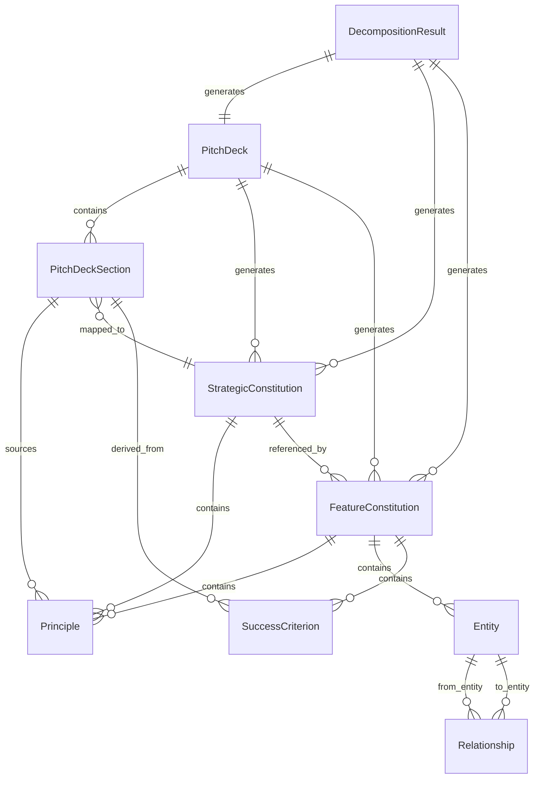

# Data Model: BP-Kit Build - Pitch Deck Decomposition

**Feature**: 003-implement-bp-decompose
**Date**: 2025-10-11
**Phase**: 1 (Design)

---

## Overview

This document defines the data entities and relationships for the `/bp.decompose` command. The data model supports three decomposition modes (interactive, markdown, PDF) and generates constitutional artifacts with bidirectional traceability.

---

## Core Entities

### 1. PitchDeck

**Purpose**: Represents Sequoia Capital pitch deck containing 10 canonical sections.

**Attributes**:
- `version`: SemanticVersion - Current deck version (e.g., "1.0.0")
- `source_mode`: DecompositionMode - How deck was created (INTERACTIVE | FROM_FILE | FROM_PDF)
- `created_at`: datetime - Initial creation timestamp
- `updated_at`: datetime - Last modification timestamp
- `file_path`: Path - Canonical location (`.specify/deck/pitch-deck.md`)
- `sections`: List[PitchDeckSection] - 10 Sequoia sections (ordered)

**Relationships**:
- has_many: PitchDeckSection (10 sections)
- generates: List[StrategicConstitution] (4 constitutions)
- generates: List[FeatureConstitution] (5-10 constitutions)

**Constraints**:
- Must have exactly 10 sections (Sequoia template)
- version must follow SemVer (MAJOR.MINOR.PATCH)
- file_path must be `.specify/deck/pitch-deck.md` (canonical)

**Lifecycle**:
- States: DRAFT → COMPLETE → DECOMPOSED
- Draft: Sections being filled (interactive mode)
- Complete: All sections populated
- Decomposed: Constitutions generated

---

### 2. PitchDeckSection

**Purpose**: Individual section within pitch deck (e.g., Problem, Solution, Business Model).

**Attributes**:
- `section_id`: str - GitHub-style heading ID (e.g., "company-purpose", "problem")
- `title`: str - Display name (e.g., "Company Purpose", "Problem")
- `content`: str - Markdown-formatted section content
- `position`: int - Order in deck (1-10)
- `section_type`: SequoiaSectionType - Enum of 10 canonical types
- `is_complete`: bool - Has non-placeholder content
- `extraction_confidence`: float - For PDF mode (0.0-1.0)

**Relationships**:
- belongs_to: PitchDeck
- referenced_by: List[Principle] (strategic principles sourced from this section)
- mapped_to: StrategicConstitution (via SECTION_CONSTITUTION_MAP)

**Constraints**:
- section_id must be valid GitHub heading ID (lowercase, hyphens, no special chars)
- position must be 1-10
- content cannot be empty for is_complete=True
- extraction_confidence only set for source_mode=FROM_PDF

**Lifecycle**:
- States: EMPTY → IN_PROGRESS → COMPLETE → REVIEWED
- Interactive mode: User fills section by section
- File mode: Parsed from markdown
- PDF mode: Extracted with confidence scoring

---

### 3. SequoiaSectionType (Enum)

**Purpose**: Canonical 10-section Sequoia pitch deck structure.

**Values**:
```python
class SequoiaSectionType(Enum):
    COMPANY_PURPOSE = "company-purpose"
    PROBLEM = "problem"
    SOLUTION = "solution"
    WHY_NOW = "why-now"
    MARKET_POTENTIAL = "market-potential"
    COMPETITION = "competition"
    PRODUCT = "product"
    BUSINESS_MODEL = "business-model"
    TEAM = "team"
    FINANCIALS = "financials"
```

**Section-to-Constitution Mapping** (FR-003):
```python
SECTION_CONSTITUTION_MAP = {
    SequoiaSectionType.COMPANY_PURPOSE: "company-constitution.md",
    SequoiaSectionType.PROBLEM: "company-constitution.md",
    SequoiaSectionType.SOLUTION: "product-constitution.md",
    SequoiaSectionType.WHY_NOW: "company-constitution.md",
    SequoiaSectionType.PRODUCT: "product-constitution.md",
    SequoiaSectionType.MARKET_POTENTIAL: "market-constitution.md",
    SequoiaSectionType.COMPETITION: "market-constitution.md",
    SequoiaSectionType.BUSINESS_MODEL: "business-constitution.md",
    SequoiaSectionType.FINANCIALS: "business-constitution.md",
    SequoiaSectionType.TEAM: "business-constitution.md",
}
```

---

### 4. Principle

**Purpose**: Constitutional principle extracted from pitch deck section.

**Attributes**:
- `principle_id`: str - Unique ID (e.g., "principle-001")
- `text`: str - Principle statement (e.g., "Platform fee is 10% of transaction value")
- `principle_type`: PrincipleType - STRATEGIC | TACTICAL
- `source_section_id`: str - Link to PitchDeckSection.section_id
- `source_section_line`: int - Approximate line number in section
- `constitution_file`: str - Which constitution file contains this principle
- `confidence`: float - Extraction confidence (0.0-1.0)
- `extraction_method`: str - Which heuristic extracted it (e.g., "NUMERIC_CONSTRAINT", "VALUE_PROP")

**Relationships**:
- sourced_from: PitchDeckSection
- belongs_to: StrategicConstitution (if STRATEGIC) OR FeatureConstitution (if TACTICAL)
- referenced_by: List[FeatureConstitution] (via Upstream links)

**Constraints**:
- text must be ≥3 words (filter noise)
- text must not contain implementation details ("using", "built with")
- confidence must be 0.0-1.0
- Strategic principles go to strategic constitutions, tactical to features

**Lifecycle**:
- States: EXTRACTED → VALIDATED → REFERENCED
- Extracted: Initially identified by heuristics
- Validated: Passed filtering rules (is_valid_principle)
- Referenced: Linked from downstream constitutions

---

### 5. StrategicConstitution

**Purpose**: High-level constitutional document (company, product, market, business).

**Attributes**:
- `constitution_type`: ConstitutionType - COMPANY | PRODUCT | MARKET | BUSINESS
- `version`: SemanticVersion - Current version (e.g., "1.0.0")
- `file_path`: Path - Location (`.specify/memory/{type}-constitution.md`)
- `created_at`: datetime
- `updated_at`: datetime
- `pitch_deck_version`: SemanticVersion - Source pitch deck version
- `principles`: List[Principle] - Strategic principles extracted
- `source_sections`: List[str] - section_ids that contributed principles

**Relationships**:
- generated_from: PitchDeck
- contains: List[Principle] (strategic principles)
- referenced_by: List[FeatureConstitution] (via Upstream links)

**Constraints**:
- Must have ≥1 principle (cannot be empty)
- file_path must follow pattern `.specify/memory/{type}-constitution.md`
- version must sync with pitch_deck_version (MINOR bump on re-decomposition)
- All principles must have valid source_section_id links

**Lifecycle**:
- States: GENERATED → VALIDATED → STABLE
- Generated: Created by decomposition
- Validated: All traceability links confirmed by `/bp.analyze`
- Stable: No changes for 1+ decomposition cycles

---

### 6. FeatureConstitution

**Purpose**: Feature-level constitutional document for one MVP capability.

**Attributes**:
- `feature_id`: str - Sequential number (e.g., "001", "002", ..., "010")
- `feature_name`: str - Kebab-case name (e.g., "user-management", "booking-system")
- `version`: SemanticVersion - Current version
- `file_path`: Path - Location (`.specify/features/{feature_id}-{feature_name}.md`)
- `created_at`: datetime
- `updated_at`: datetime
- `pitch_deck_version`: SemanticVersion - Source pitch deck version
- `upstream_constitutions`: List[str] - Strategic constitution files referenced
- `principles`: List[Principle] - Tactical principles (feature-specific)
- `entities`: List[Entity] - Domain entities (names + relationships)
- `success_criteria`: List[SuccessCriterion] - Derived + placeholder criteria
- `priority`: Priority - P1 | P2 | P3

**Relationships**:
- generated_from: PitchDeck (via Product/Solution sections)
- references: List[StrategicConstitution] (upstream links)
- contains: List[Entity] (domain model stubs)
- contains: List[SuccessCriterion]

**Constraints**:
- feature_id must be 001-010 (max 10 features per decomposition)
- feature_name must be kebab-case (lowercase, hyphens only)
- Must reference ≥1 strategic constitution (cannot be orphaned)
- Must have ≥1 success criterion (derived or placeholder)
- entities list can be empty (delegate to Speckit) or contain entity stubs

**Lifecycle**:
- States: GENERATED → ENRICHED → IMPLEMENTED
- Generated: Created by decomposition with entity/criteria stubs
- Enriched: Speckit adds entity details, refines criteria
- Implemented: Code generated from this constitution

---

### 7. Entity

**Purpose**: Domain entity extracted from pitch deck (hybrid extraction strategy).

**Attributes**:
- `entity_name`: str - Entity name (e.g., "User", "Listing", "Booking")
- `source_section_id`: str - Section where entity was inferred
- `rationale`: str - Why entity exists (context from pitch deck)
- `relationships`: List[Relationship] - Inferred relationships to other entities
- `is_placeholder`: bool - True if attributes/constraints are TODO

**Relationships**:
- belongs_to: FeatureConstitution
- related_to: List[Entity] (via relationships)

**Constraints**:
- entity_name must be CamelCase (capitalize first letter)
- Must have ≥1 relationship to other entities (no orphans)
- rationale must include source link to pitch deck section

**Lifecycle**:
- States: INFERRED → VALIDATED → ENRICHED
- Inferred: Extracted from use case sentences
- Validated: Relationships make semantic sense
- Enriched: Speckit adds attributes, constraints, lifecycle

---

### 8. Relationship

**Purpose**: Inferred relationship between entities (has_many, belongs_to, has_one).

**Attributes**:
- `relationship_type`: RelationshipType - HAS_MANY | BELONGS_TO | HAS_ONE
- `from_entity`: str - Source entity name
- `to_entity`: str - Target entity name
- `inferred_from`: str - Source sentence that implied relationship
- `confidence`: float - Inference confidence (0.0-1.0)

**Relationships**:
- connects: Entity → Entity

**Constraints**:
- from_entity and to_entity must exist in same FeatureConstitution
- inferred_from must be non-empty string (traceability to source text)
- confidence must be 0.0-1.0

---

### 9. SuccessCriterion

**Purpose**: Measurable success criterion (derived or placeholder).

**Attributes**:
- `criterion_id`: str - Unique ID (e.g., "SC-002-001")
- `text`: str - Criterion statement (e.g., "Commission calculation accurate to 0.01%")
- `criterion_type`: CriterionType - DERIVED | PLACEHOLDER
- `source_metric`: str - Business metric this derived from (e.g., "10% commission")
- `source_section_id`: str - Link to PitchDeckSection
- `confidence`: float - Derivation confidence (only for DERIVED)
- `guidance`: str - For placeholders, suggested approaches
- `rationale`: str - For derived, why this criterion matters
- `test_description`: str - How to validate criterion

**Relationships**:
- belongs_to: FeatureConstitution
- derived_from: PitchDeckSection (via source_section_id)

**Constraints**:
- criterion_type DERIVED must have confidence, rationale, test_description
- criterion_type PLACEHOLDER must have guidance
- text must be measurable (contain number or percentage)

---

### 10. DecompositionResult

**Purpose**: Outcome of a decomposition operation (for changelog).

**Attributes**:
- `decomposition_id`: str - Unique ID (e.g., "decompose-2025-10-11-v1.0.0")
- `mode`: DecompositionMode - INTERACTIVE | FROM_FILE | FROM_PDF
- `pitch_deck_version`: SemanticVersion - Version after decomposition
- `timestamp`: datetime
- `strategic_constitutions_generated`: int - Count (should be 4)
- `feature_constitutions_generated`: int - Count (5-10)
- `traceability_links_created`: int - Total link count
- `changelog_file`: Path - Generated changelog entry
- `warnings`: List[str] - Warnings generated (missing sections, low confidence)
- `errors`: List[str] - Errors encountered

**Relationships**:
- generates: PitchDeck (updated version)
- generates: List[StrategicConstitution]
- generates: List[FeatureConstitution]
- creates: ChangelogEntry

**Constraints**:
- strategic_constitutions_generated must be 4 (FR-003)
- feature_constitutions_generated must be 5-10 (FR-004)
- If errors not empty, decomposition considered failed

---

## Supporting Enums

### DecompositionMode
```python
class DecompositionMode(Enum):
    INTERACTIVE = "interactive"  # --interactive flag
    FROM_FILE = "from-file"      # --from-file <path>
    FROM_PDF = "from-pdf"        # --from-pdf <path>
```

### ConstitutionType
```python
class ConstitutionType(Enum):
    COMPANY = "company"
    PRODUCT = "product"
    MARKET = "market"
    BUSINESS = "business"
```

### PrincipleType
```python
class PrincipleType(Enum):
    STRATEGIC = "strategic"  # Goes to strategic constitutions
    TACTICAL = "tactical"    # Goes to feature constitutions
```

### CriterionType
```python
class CriterionType(Enum):
    DERIVED = "derived"          # Generated from clear business metric
    PLACEHOLDER = "placeholder"  # Structured placeholder with guidance
```

### RelationshipType
```python
class RelationshipType(Enum):
    HAS_MANY = "has_many"
    BELONGS_TO = "belongs_to"
    HAS_ONE = "has_one"
```

### Priority
```python
class Priority(Enum):
    P1 = "P1"  # Critical MVP feature
    P2 = "P2"  # Important but not blocking
    P3 = "P3"  # Nice-to-have
```

---

## Entity Relationship Diagram (Mermaid)



---

## Data Flow

### Decomposition Workflow

```
1. Input (one of three modes):
   - Interactive: User answers Sequoia section questions → PitchDeck
   - From File: Parse markdown file → PitchDeck
   - From PDF: Extract text, detect sections → PitchDeck

2. Section Processing:
   - For each PitchDeckSection:
     - Extract Principles (via principle_extractor.py heuristics)
     - Map to StrategicConstitution (via SECTION_CONSTITUTION_MAP)

3. Strategic Constitution Generation:
   - Group Principles by constitution_type (COMPANY | PRODUCT | MARKET | BUSINESS)
   - Generate 4 StrategicConstitution files with traceability links

4. Feature Detection:
   - Parse Product + Solution sections
   - Extract 5-10 features (via feature_detector.py heuristics)
   - For each feature:
     - Extract Entities (names + relationships)
     - Generate SuccessCriteria (derived + placeholders)
     - Link to upstream StrategicConstitutions

5. Feature Constitution Generation:
   - Generate 5-10 FeatureConstitution files
   - Include entity stubs, success criteria, upstream links

6. Validation:
   - Verify all traceability links (via link_validator.py from Feature 002)
   - Check version consistency
   - Validate entity relationships

7. Changelog:
   - Create DecompositionResult
   - Generate changelog entry with all links and counts
```

---

## Validation Rules

### PitchDeck Validation
- Must have exactly 10 sections (warn if fewer)
- All section_ids must be valid GitHub heading IDs
- No duplicate section_ids
- Version must be valid SemVer

### StrategicConstitution Validation
- Must contain ≥1 principle
- All principles must have valid source_section_id
- All source_section_id links must resolve to pitch deck sections
- Version must not be older than pitch_deck_version

### FeatureConstitution Validation
- Must reference ≥1 strategic constitution (no orphans)
- All upstream links must resolve to strategic constitution principles
- feature_id must be unique across all features
- feature_name must be valid kebab-case

### Principle Validation
- text must be ≥3 words
- text must not contain implementation keywords ("using", "built with", "powered by")
- text must not be vague without quantification ("fast", "scalable" without numbers)
- source_section_id must resolve to valid PitchDeckSection

### Entity Validation
- entity_name must be CamelCase
- Must have ≥1 relationship (no orphans)
- All relationship targets must exist in same FeatureConstitution

### SuccessCriterion Validation
- DERIVED type must have confidence ≥ 0.7 (high confidence threshold)
- PLACEHOLDER type must have non-empty guidance
- text must be measurable (contain metric or number)

---

## Storage Format

### YAML Frontmatter

All generated markdown files include YAML frontmatter:

```yaml
---
version: 1.0.0
type: strategic | feature
created: 2025-10-11
updated: 2025-10-11
source: pitch-deck.md
pitch_deck_version: 1.0.0
upstream:
  - company-constitution.md
  - product-constitution.md
---
```

### Traceability Link Format

Markdown links with GitHub-style heading IDs:

```markdown
**Source**: [`pitch-deck.md#business-model`](../deck/pitch-deck.md#business-model)

**Upstream**: [`company-constitution.md#principle-2`](../memory/company-constitution.md#principle-2)
```

---

## Performance Considerations

### Memory
- PitchDeck: ~50 KB (10 sections × 5 KB average)
- StrategicConstitution: ~20 KB each × 4 = 80 KB
- FeatureConstitution: ~30 KB each × 10 = 300 KB
- **Total decomposition output**: ~430 KB (well within memory limits)

### Computation
- Principle extraction: O(n) where n = total section content length
- Feature detection: O(m) where m = Product + Solution section length
- Link validation: O(k) where k = total number of traceability links (typically 30-50)
- **Expected total time**: <2 minutes (SC-001 requirement)

---

## Integration with Feature 002

**Reused Models**:
- Constitution (base class) → Extended for Strategic/Feature distinction
- PitchDeck (base model) → Extended with Sequoia section types
- TraceabilityLink → Used for validation

**Reused Infrastructure**:
- VersionMetadata (from version_tracker.py)
- LinkValidationResult (from link_validator.py)
- MarkdownSection (from markdown_parser.py)

---

## Next Steps

1. **Contracts**: Define YAML schemas for Sequoia template, strategic/feature constitutions
2. **Quickstart**: Document typical workflows (interactive, file, PDF modes)
3. **Agent Context**: Update Claude Code context with new models and decomposition patterns

---

**Data Model Complete**: 2025-10-11
**Next**: Contract Definitions (contracts/*.yaml)
